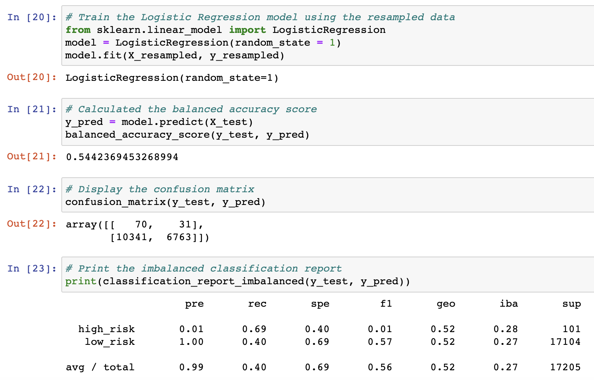

# Credit Risk Analysis

## Overview
Credit risk is an inherently unbalanced classification problem, as good loans easily outnumber risky loans. This analysis was completed to understand and compare various linear models with unbalanced classes. The scikit-learn libraries were used  - and the following models were tested and compared:
* Naive Oversampling
* SMOTE Oversampling
* Cluster Centroid Undersampling
* SMOTEEN Combination Sampling
* Easy Ensemble AdaBoost Classifier
* Balanced Random Forest Classifier 

## Results
### Naive Oversampling
67% Accuracy Score

### SMOTE Oversampling
69% Accuracy Score

### Cluster Centroid Undersampling
Accuracy Score N/A

### SMOTEEN Combination Sampling
64% Accuracy Score

### Easy Ensemble AdaBoost Classifier
100% Accuracy Score

### Balanced Forest Classifier
100% Accuracy Score

## Summary
Based on this analysis, the easy ensemble and balanced forest classifier models should be used. Both models have a 100% accuracy score and should be trusted over the over, under and combination resampling models. The cluster centroid model was unable to converge on a fit. In this case, this undersampling model should not be used.

