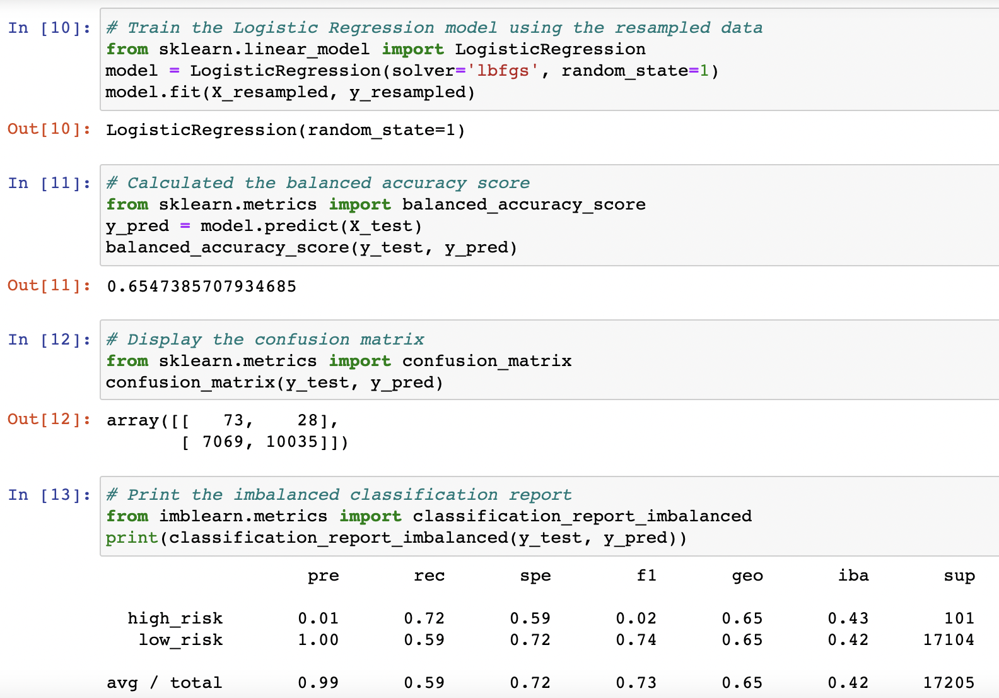
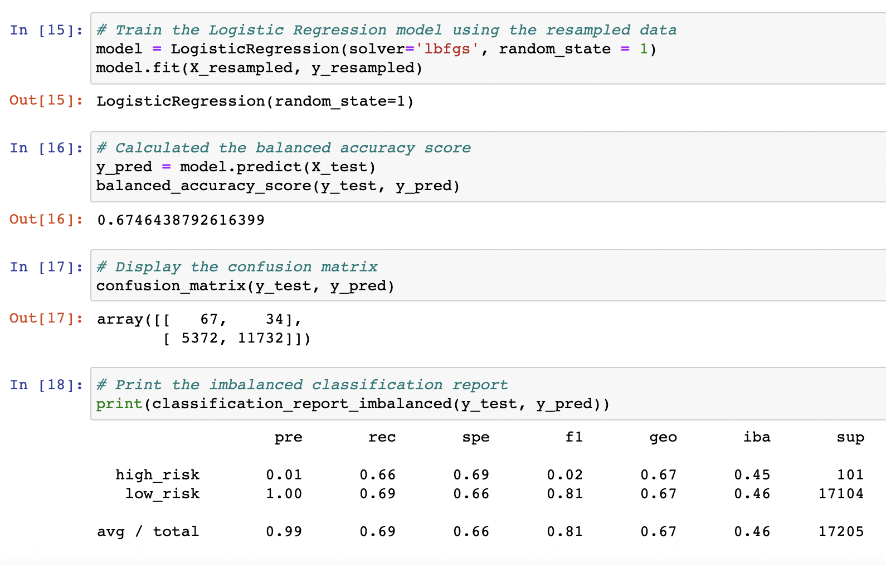
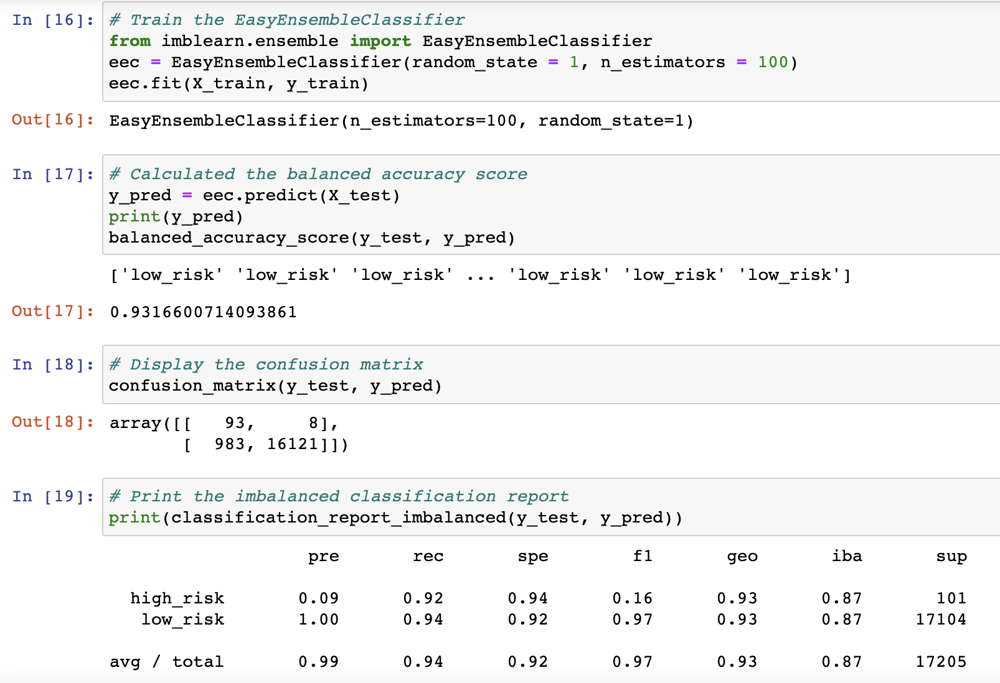

# Credit Risk Analysis

## Overview
Credit risk is an inherently unbalanced classification problem, as good loans easily outnumber risky loans. This analysis was completed to understand and compare various linear models with unbalanced classes. The scikit-learn libraries were used  - and the following models were tested and compared:
* Naive Oversampling
* SMOTE Oversampling
* Cluster Centroid Undersampling
* SMOTEEN Combination Sampling
* Easy Ensemble AdaBoost Classifier
* Balanced Random Forest Classifier 

## Results
### Naive Oversampling
65.5% Accuracy Score

### SMOTE Oversampling
67.4% Accuracy Score

### Cluster Centroid Undersampling
54.4% Accuracy Score

### SMOTEEN Combination Sampling
66.7% Accuracy Score

### Easy Ensemble AdaBoost Classifier
93.2% Accuracy Score

### Balanced Forest Classifier
78.8% Accuracy Score

## Summary
Based on this analysis, the easy ensemble classifier models should be used. Thi model has a 93.2% accuracy score and should be trusted over the other under and combination resampling models. 

